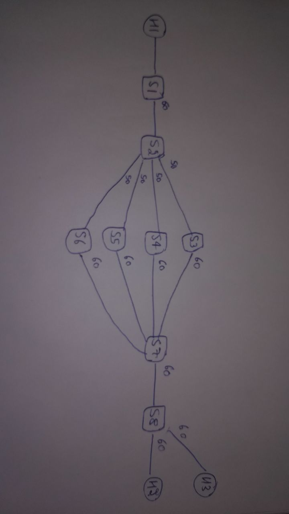

# INT using P4 
We have a linear topology with 8 switches as shown in below figure 

- Out of these 8 switches 4 are bottleneck switches as they are rate limited. All the switches are P4's bmv2 model backend target simple_switch_grpc which talks over p4Runtime API to remote python based custom Controller.   
- Implement Traffic Engineering using the below topology.
Here S3,S4,S5,S6 are bottleneck switches and the numbers on the each ports is the queue rate for that particular port. Once the queue depth crosses the threshold, the controller will dynamically adjust the egress port of the flow to load balance equally on all egress ports of the S2 switch.
- The contoller will burn the p4 program and install rules into the switches using p4Runtime API.
- Before running the P4 programs please ensure you have mininet and p4c-bm2-ss(p4-16 compiler) installed on your machine.
- To install mininet please follow the instructions from here : https://github.com/mininet/mininet/blob/cf6da391fa4a9271071dff59b41c9fe4e74277dd/INSTALL#L47
- To install p4-16 compiler please foolow this link : https://github.com/p4lang/p4c
- How to run program
  cd INT_headerstack
  ./run.sh to run the mininet and bring up program_switches
